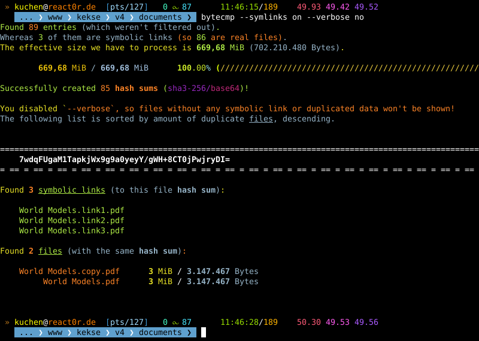

 

# `bytecmp`

Finally.. it runs \[**2026-07-08**\]! Plus a tiny update now \[**2026-08-19**\]..

 

> [!NOTE]
> First **TODO** item is now to create a better overview (and feature list) etc.
> in this `README.md`! So it's easier for you to get to know why this tool exists.

  

## Description
(**TODO**)

 

## Features
(**TODO**)

 

## Screenshots
Two examples. The first image is the output of `--help / -?`, the second one shows
an example usage of this tool. They're from version v**0.9.10**; it look's a **bit**
different now. Just a bit..

 
 

  

## Download / Source Code
* [`bytecmp.js`](./src/bytecmp.js) v**0.9.12** (updated \[**2026-08-19**\])

But the code is **pretty ugly**.. sorry. \^_\^

 

> [!IMPORTANT]
> You need to create some **polyfill**s on your own.
> I just placed the sources here for your inf0. The
> rest is up to you.. **sorry** (I've got reasons
> for this.. really)!

 

## TODO
* **Maybe** I'll give it a function to CUT DOWN the output paths, for smaller terminals. Maybe..

   

# Contact

 

# Copyright and License
The Copyright is [(c) Sebastian Kucharczyk](./COPYRIGHT.txt),
and it's licensed under the [MIT](./LICENSE.txt) (also known as 'X' or 'X11' license).

